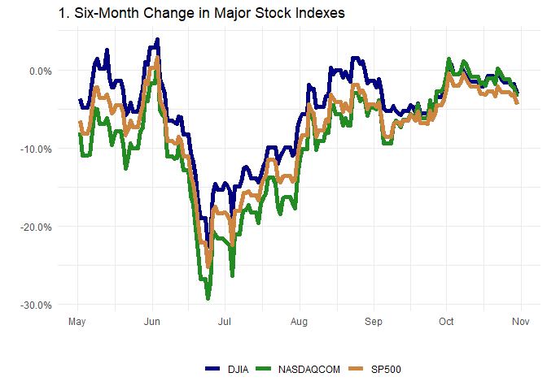
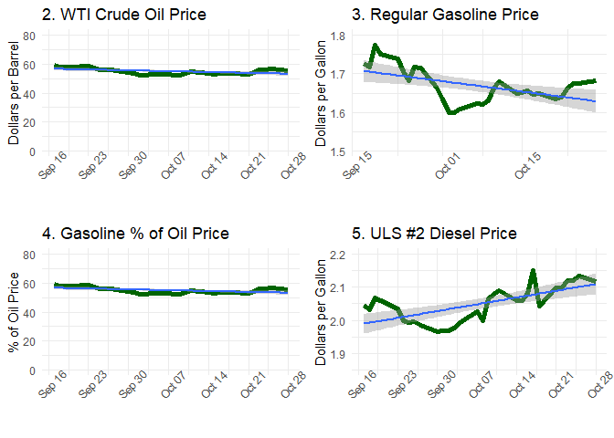

Daily information summary of economic indicators available from FRED,
FRB St. Louis
================
Paul G. Smith
11/1/2019

  - [Daily information summary of economic indicators available from
    FRED, FRB
    St. Louis](#daily-information-summary-of-economic-indicators-available-from-fred-frb-st.-louis)
      - [1. Six-Month Change in Major Stock
        Indexes](#six-month-change-in-major-stock-indexes)
      - [2. WTI Crude Oil Price](#wti-crude-oil-price)
      - [3. Regular Gasoline Price](#regular-gasoline-price)
      - [4. Gasoline % of Oil Price](#gasoline-of-oil-price)
      - [5. ULS \#2 Diesel Price](#uls-2-diesel-price)
      - [Finally, Print the Plots](#finally-print-the-plots)

## Daily information summary of economic indicators available from FRED, FRB St. Louis

``` r
source("Dependencies.R", echo = TRUE)
```

    ## 
    ## > library(fredr)
    ## 
    ## > library(dplyr)

    ## 
    ## Attaching package: 'dplyr'

    ## The following objects are masked from 'package:stats':
    ## 
    ##     filter, lag

    ## The following objects are masked from 'package:base':
    ## 
    ##     intersect, setdiff, setequal, union

    ## 
    ## > library(tidyr)
    ## 
    ## > library(lubridate)

    ## 
    ## Attaching package: 'lubridate'

    ## The following object is masked from 'package:base':
    ## 
    ##     date

    ## 
    ## > library(ggplot2)
    ## 
    ## > library(scales)
    ## 
    ## > library(gridExtra)

    ## 
    ## Attaching package: 'gridExtra'

    ## The following object is masked from 'package:dplyr':
    ## 
    ##     combine

### 1\. Six-Month Change in Major Stock Indexes

``` r
source("001_Six month indexes.R", echo = TRUE)
```

    ## 
    ## > user_api_key <- read.csv("../../fred_api_key.csv", 
    ## +     stringsAsFactors = TRUE, as.is = TRUE)
    ## 
    ## > fredr_set_key(user_api_key$fredAPIkey)
    ## 
    ## > today <- as_date(now())
    ## 
    ## > yesterday <- as_date(now() - days(1))
    ## 
    ## > end_date <- yesterday
    ## 
    ## > if (wday(yesterday) > 6) {
    ## +     end_date <- as_date(now() - days(wday(yesterday) - 6))
    ## + }
    ## 
    ## > start_date <- as_date(now() - days(26 * 7) - days())
    ## 
    ## > start_date2 <- as_date(start_date - days(26 * 7))
    ## 
    ## > end_date2 <- as_date(end_date - days(26 * 7))
    ## 
    ## > fr_DJIA <- fredr(series_id = "DJIA", start_date, end_date)
    ## 
    ## > fr_SP500 <- fredr(series_id = "SP500", start_date, 
    ## +     end_date)
    ## 
    ## > fr_NASDAQCOM <- fredr(series_id = "NASDAQCOM", start_date, 
    ## +     end_date)
    ## 
    ## > date <- seq(as_date(start_date), as_date(end_date), 
    ## +     by = "days")
    ## 
    ## > fr_dates <- as.data.frame(date)
    ## 
    ## > frIndex <- as.data.frame(bind_rows(fr_dates, fr_DJIA, 
    ## +     fr_SP500, fr_NASDAQCOM))
    ## 
    ## > frIndex$series_id <- as.factor(frIndex$series_id)
    ## 
    ## > dfIndexLast6 <- spread(frIndex, series_id, value)
    ## 
    ## > dfIndexLast6$`<NA>` <- NULL
    ## 
    ## > dfIndexLast6 <- fill(dfIndexLast6, 2:4, .direction = c("downup"))
    ## 
    ## > fr_DJIA <- fredr(series_id = "DJIA", start_date2, 
    ## +     end_date2)
    ## 
    ## > fr_SP500 <- fredr(series_id = "SP500", start_date2, 
    ## +     end_date2)
    ## 
    ## > fr_NASDAQCOM <- fredr(series_id = "NASDAQCOM", start_date2, 
    ## +     end_date2)
    ## 
    ## > date <- seq(as_date(start_date2), as_date(end_date2), 
    ## +     by = "days")
    ## 
    ## > fr_dates <- as.data.frame(date)
    ## 
    ## > frIndex <- as.data.frame(bind_rows(fr_dates, fr_DJIA, 
    ## +     fr_SP500, fr_NASDAQCOM))
    ## 
    ## > frIndex$series_id <- as.factor(frIndex$series_id)
    ## 
    ## > dfIndexPrev6 <- spread(frIndex, series_id, value)
    ## 
    ## > dfIndexPrev6$`<NA>` <- NULL
    ## 
    ## > dfIndexPrev6 <- fill(dfIndexPrev6, 2:4, .direction = c("downup"))
    ## 
    ## > dfIndexChange <- dfIndexLast6
    ## 
    ## > dfIndexChange$DJIA <- ((dfIndexPrev6$DJIA - dfIndexLast6$DJIA)/dfIndexPrev6$DJIA)
    ## 
    ## > dfIndexChange$SP500 <- ((dfIndexPrev6$SP500 - dfIndexLast6$SP500)/dfIndexPrev6$SP500)
    ## 
    ## > dfIndexChange$NASDAQCOM <- ((dfIndexPrev6$NASDAQCOM - 
    ## +     dfIndexLast6$NASDAQCOM)/dfIndexPrev6$NASDAQCOM)
    ## 
    ## > dfIndexChange_long <- gather(dfIndexChange, Symbol, 
    ## +     Change, -date)
    ## 
    ## > p1 <- ggplot(dfIndexChange_long, aes(x = date, y = Change, 
    ## +     group = Symbol))
    ## 
    ## > p1 <- p1 + geom_line(aes(color = Symbol), size = 2) + 
    ## +     scale_y_continuous(labels = scales::percent) + scale_color_manual(values = c("navyblue" .... [TRUNCATED]

### 2\. WTI Crude Oil Price

``` r
source("002_WTI crude oil price.R", echo = TRUE)
```

    ## 
    ## > user_api_key <- read.csv("../../fred_api_key.csv", 
    ## +     stringsAsFactors = TRUE, as.is = TRUE)
    ## 
    ## > fredr_set_key(user_api_key$fredAPIkey)
    ## 
    ## > today <- as_date(now())
    ## 
    ## > yesterday <- as_date(now() - days(1))
    ## 
    ## > end_date <- yesterday
    ## 
    ## > if (wday(yesterday) > 6) {
    ## +     end_date <- as_date(now() - days(wday(yesterday) - 6))
    ## + }
    ## 
    ## > start_date <- as_date(yesterday - days(45))
    ## 
    ## > fr_DCOILWTICO <- fredr(series_id = "DCOILWTICO", start_date, 
    ## +     end_date)
    ## 
    ## > fr_DCOILWTICO$series_id <- NULL
    ## 
    ## > names(fr_DCOILWTICO)[2] <- "DCOILWTICO"
    ## 
    ## > p2 <- ggplot(fr_DCOILWTICO, aes(x = date, y = DCOILWTICO))
    ## 
    ## > p2 <- p2 + geom_line(size = 2, color = "darkgreen") + 
    ## +     theme_minimal() + scale_x_date(breaks = pretty_breaks(6)) + 
    ## +     scale_y_continuous(l .... [TRUNCATED]

### 3\. Regular Gasoline Price

``` r
source("003_Gas gulf coast regular price.R", echo = TRUE)
```

    ## 
    ## > user_api_key <- read.csv("../../fred_api_key.csv", 
    ## +     stringsAsFactors = TRUE, as.is = TRUE)
    ## 
    ## > fredr_set_key(user_api_key$fredAPIkey)
    ## 
    ## > today <- as_date(now())
    ## 
    ## > yesterday <- as_date(now() - days(1))
    ## 
    ## > end_date <- yesterday
    ## 
    ## > if (wday(yesterday) > 6) {
    ## +     end_date <- as_date(now() - days(wday(yesterday) - 6))
    ## + }
    ## 
    ## > start_date <- as_date(yesterday - days(45))
    ## 
    ## > fr_DGASUSGULF <- fredr(series_id = "DGASUSGULF", start_date, 
    ## +     end_date)
    ## 
    ## > fr_DGASUSGULF$series_id <- NULL
    ## 
    ## > names(fr_DGASUSGULF)[2] <- "DGASUSGULF"
    ## 
    ## > p3 <- ggplot(fr_DGASUSGULF, aes(x = date, y = DGASUSGULF))
    ## 
    ## > p3 <- p3 + geom_line(size = 2, color = "darkgreen") + 
    ## +     theme_minimal() + scale_x_date(breaks = pretty_breaks(4)) + 
    ## +     xlab("") + scale_y_c .... [TRUNCATED]

### 4\. Gasoline % of Oil Price

``` r
source("004_Gas percent of oil.R", echo = TRUE)
```

    ## 
    ## > user_api_key <- read.csv("../../fred_api_key.csv", 
    ## +     stringsAsFactors = TRUE, as.is = TRUE)
    ## 
    ## > fredr_set_key(user_api_key$fredAPIkey)
    ## 
    ## > today <- as_date(now())
    ## 
    ## > yesterday <- as_date(now() - days(1))
    ## 
    ## > end_date <- yesterday
    ## 
    ## > if (wday(yesterday) > 6) {
    ## +     end_date <- as_date(now() - days(wday(yesterday) - 6))
    ## + }
    ## 
    ## > start_date <- as_date(yesterday - days(45))
    ## 
    ## > fr_DCOILWTICO <- fredr(series_id = "DCOILWTICO", start_date, 
    ## +     end_date)
    ## 
    ## > fr_DCOILWTICO$series_id <- NULL
    ## 
    ## > names(fr_DCOILWTICO)[2] <- "DCOILWTICO"
    ## 
    ## > p4 <- ggplot(fr_DCOILWTICO, aes(x = date, y = DCOILWTICO))
    ## 
    ## > p4 <- p4 + geom_line(size = 2, color = "darkgreen") + 
    ## +     theme_minimal() + scale_x_date(breaks = pretty_breaks(6)) + 
    ## +     scale_y_continuous(l .... [TRUNCATED]

### 5\. ULS \#2 Diesel Price

``` r
source("005_ULS 2 diesel price.R", echo = TRUE)
```

    ## 
    ## > today <- as_date(now())
    ## 
    ## > yesterday <- as_date(now() - days(1))
    ## 
    ## > end_date <- yesterday
    ## 
    ## > if (wday(yesterday) > 6) {
    ## +     end_date <- as_date(now() - days(wday(yesterday) - 6))
    ## + }
    ## 
    ## > start_date <- as_date(yesterday - days(45))
    ## 
    ## > fr_DDFUELLA <- fredr(series_id = "DDFUELLA", start_date, 
    ## +     end_date)
    ## 
    ## > fr_DDFUELLA$series_id <- NULL
    ## 
    ## > names(fr_DDFUELLA)[2] <- "DDFUELLA"
    ## 
    ## > p5 <- ggplot(fr_DDFUELLA, aes(x = date, y = DDFUELLA))
    ## 
    ## > p5 <- p5 + geom_line(size = 2, color = "darkgreen") + 
    ## +     theme_minimal() + scale_x_date(breaks = pretty_breaks(6)) + 
    ## +     scale_y_continuous(l .... [TRUNCATED]

### Finally, Print the Plots

<!-- --><!-- -->
