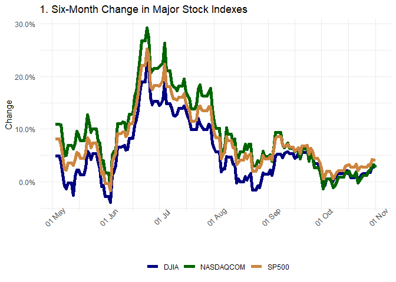
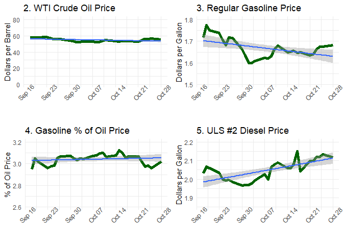
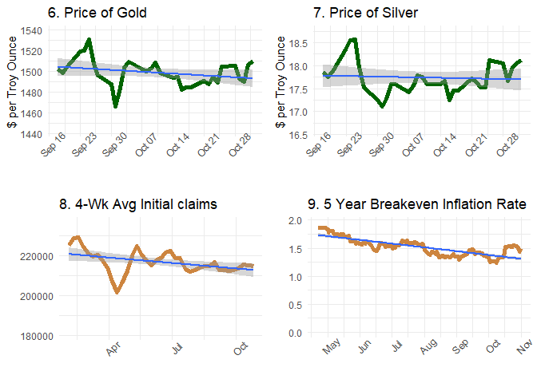

Daily information summary of economic indicators available from FRED,
FRB St. Louis
================
Paul G. Smith
First created on Oct 31, 2019. Updated on Nov 02, 2019

  - [Daily information summary of economic indicators available from
    FRED, FRB
    St. Louis](#daily-information-summary-of-economic-indicators-available-from-fred-frb-st.-louis)
      - [Saturday Morning Update: November 02,
        2019](#saturday-morning-update-november-02-2019)
      - [1. Six-Month Change in Major Stock
        Indexes](#six-month-change-in-major-stock-indexes)
      - [2. WTI Crude Oil Price](#wti-crude-oil-price)
      - [3. Regular Gasoline Price](#regular-gasoline-price)
      - [4. Gasoline % of Oil Price](#gasoline-of-oil-price)
      - [5. ULS \#2 Diesel Price](#uls-2-diesel-price)
      - [6. Price of Gold](#price-of-gold)
      - [7. Price of Silver](#price-of-silver)
      - [8. 4-Wk Moving Avg Unemployment Initial
        Claims](#wk-moving-avg-unemployment-initial-claims)
      - [9. Breakeven Inflation, 5-Year](#breakeven-inflation-5-year)
      - [Finally, Print the Plots for Saturday Morning Update: November
        02,
        2019](#finally-print-the-plots-for-saturday-morning-update-november-02-2019)

## Daily information summary of economic indicators available from FRED, FRB St. Louis

``` r
source("Dependencies.R", echo = TRUE)
```

    ## 
    ## > library(fredr)
    ## 
    ## > library(dplyr)

    ## 
    ## Attaching package: 'dplyr'

    ## The following objects are masked from 'package:stats':
    ## 
    ##     filter, lag

    ## The following objects are masked from 'package:base':
    ## 
    ##     intersect, setdiff, setequal, union

    ## 
    ## > library(tidyr)
    ## 
    ## > library(lubridate)

    ## 
    ## Attaching package: 'lubridate'

    ## The following object is masked from 'package:base':
    ## 
    ##     date

    ## 
    ## > library(ggplot2)
    ## 
    ## > library(scales)
    ## 
    ## > library(gridExtra)

    ## 
    ## Attaching package: 'gridExtra'

    ## The following object is masked from 'package:dplyr':
    ## 
    ##     combine

    ## 
    ## > user_api_key <- read.csv("../../fred_api_key.csv", 
    ## +     stringsAsFactors = TRUE, as.is = TRUE)
    ## 
    ## > fredr_set_key(user_api_key$fredAPIkey)

``` r
source("Functions.R", echo = TRUE)
```

    ## 
    ## > makeFREDtable <- function(symbol, start.date, end.date) {
    ## +     df <- fredr(series_id = symbol, start.date, end.date)
    ## +     df$series_id <- NULL
    ## +   .... [TRUNCATED]

### Saturday Morning Update: November 02, 2019

### 1\. Six-Month Change in Major Stock Indexes

``` r
source("001_Six month indexes.R", echo = TRUE)
```

    ## 
    ## > end_date <- now() - 1
    ## 
    ## > if (wday(now() - 1) > 6 || wday(now() - 1) == 1) {
    ## +     end_date <- as_date(now() - days(wday(now() - 1) - 6))
    ## + }
    ## 
    ## > start_date <- as_date((now() - 1) - days(26 * 7) - 
    ## +     days(1))
    ## 
    ## > end_date2 <- start_date
    ## 
    ## > start_date2 <- start_date - days(26 * 7)
    ## 
    ## > end_date - start_date
    ## Time difference of 182 days
    ## 
    ## > end_date2 - start_date2
    ## Time difference of 182 days
    ## 
    ## > fr_DJIA <- fredr(series_id = "DJIA", start_date, end_date)
    ## 
    ## > fr_SP500 <- fredr(series_id = "SP500", start_date, 
    ## +     end_date)
    ## 
    ## > fr_NASDAQCOM <- fredr(series_id = "NASDAQCOM", start_date, 
    ## +     end_date)
    ## 
    ## > date <- seq(as_date(start_date), as_date(end_date), 
    ## +     by = "days")
    ## 
    ## > fr_dates <- as.data.frame(date)
    ## 
    ## > frIndex <- as.data.frame(bind_rows(fr_dates, fr_DJIA, 
    ## +     fr_SP500, fr_NASDAQCOM))
    ## 
    ## > frIndex$series_id <- as.factor(frIndex$series_id)
    ## 
    ## > dfIndexLast6 <- spread(frIndex, series_id, value)
    ## 
    ## > dfIndexLast6$`<NA>` <- NULL
    ## 
    ## > dfIndexLast6 <- fill(dfIndexLast6, 2:4, .direction = c("downup"))
    ## 
    ## > fr_DJIA <- fredr(series_id = "DJIA", start_date2, 
    ## +     end_date2)
    ## 
    ## > fr_SP500 <- fredr(series_id = "SP500", start_date2, 
    ## +     end_date2)
    ## 
    ## > fr_NASDAQCOM <- fredr(series_id = "NASDAQCOM", start_date2, 
    ## +     end_date2)
    ## 
    ## > date <- seq(as_date(start_date2), as_date(end_date2), 
    ## +     by = "days")
    ## 
    ## > fr_dates <- as.data.frame(date)
    ## 
    ## > frIndex <- as.data.frame(bind_rows(fr_dates, fr_DJIA, 
    ## +     fr_SP500, fr_NASDAQCOM))
    ## 
    ## > frIndex$series_id <- as.factor(frIndex$series_id)
    ## 
    ## > dfIndexPrev6 <- spread(frIndex, series_id, value)
    ## 
    ## > dfIndexPrev6$`<NA>` <- NULL
    ## 
    ## > dfIndexPrev6 <- fill(dfIndexPrev6, 2:4, .direction = c("downup"))
    ## 
    ## > dfIndexChange <- dfIndexLast6
    ## 
    ## > dfIndexChange$DJIA <- ((dfIndexLast6$DJIA - dfIndexPrev6$DJIA)/dfIndexPrev6$DJIA)
    ## 
    ## > dfIndexChange$SP500 <- ((dfIndexLast6$SP500 - dfIndexPrev6$SP500)/dfIndexPrev6$SP500)
    ## 
    ## > dfIndexChange$NASDAQCOM <- ((dfIndexLast6$NASDAQCOM - 
    ## +     dfIndexPrev6$NASDAQCOM)/dfIndexPrev6$NASDAQCOM)
    ## 
    ## > dfIndexChange_long <- gather(dfIndexChange, Symbol, 
    ## +     Change, -date)
    ## 
    ## > p1 <- ggplot(dfIndexChange_long, aes(x = date, y = Change, 
    ## +     group = Symbol))
    ## 
    ## > p1 <- p1 + geom_line(aes(color = Symbol), size = 2) + 
    ## +     scale_y_continuous(labels = scales::percent) + scale_color_manual(values = c("navyblue" .... [TRUNCATED]

### 2\. WTI Crude Oil Price

``` r
source("002_WTI crude oil price.R", echo = TRUE)
```

    ## 
    ## > user_api_key <- read.csv("../../fred_api_key.csv", 
    ## +     stringsAsFactors = TRUE, as.is = TRUE)
    ## 
    ## > fredr_set_key(user_api_key$fredAPIkey)
    ## 
    ## > end_date <- now() - 1
    ## 
    ## > if (wday(now() - 1) > 6 || wday(now() - 1) == 1) {
    ## +     end_date <- as_date(now() - days(wday(now() - 1) - 6))
    ## + }
    ## 
    ## > start_date <- as_date((now() - 1) - days(45))
    ## 
    ## > fr_DCOILWTICO <- makeFREDtable("DCOILWTICO", start.date = start_date, 
    ## +     end.date = end_date)
    ## 
    ## > p2 <- ggplot(fr_DCOILWTICO, aes(x = date, y = DCOILWTICO))
    ## 
    ## > p2 <- p2 + geom_line(size = 2, color = "darkgreen") + 
    ## +     theme_minimal() + scale_x_date(breaks = pretty_breaks(6)) + 
    ## +     scale_y_continuous(l .... [TRUNCATED]

### 3\. Regular Gasoline Price

``` r
source("003_Gas gulf coast regular price.R", echo = TRUE)
```

    ## 
    ## > user_api_key <- read.csv("../../fred_api_key.csv", 
    ## +     stringsAsFactors = TRUE, as.is = TRUE)
    ## 
    ## > fredr_set_key(user_api_key$fredAPIkey)
    ## 
    ## > end_date <- now() - 1
    ## 
    ## > if (wday(now() - 1) > 6 || wday(now() - 1) == 1) {
    ## +     end_date <- as_date(now() - days(wday(now() - 1) - 6))
    ## + }
    ## 
    ## > start_date <- as_date((now() - 1) - days(45))
    ## 
    ## > fr_DGASUSGULF <- makeFREDtable("DGASUSGULF", start.date = start_date, 
    ## +     end.date = end_date)
    ## 
    ## > p3 <- ggplot(fr_DGASUSGULF, aes(x = date, y = DGASUSGULF))
    ## 
    ## > p3 <- p3 + geom_line(size = 2, color = "darkgreen") + 
    ## +     theme_minimal() + scale_x_date(breaks = pretty_breaks(6)) + 
    ## +     xlab("") + scale_y_c .... [TRUNCATED]

### 4\. Gasoline % of Oil Price

``` r
source("004_Gas percent of oil.R", echo = TRUE)
```

    ## 
    ## > fr_gaspercentoil <- fr_DGASUSGULF
    ## 
    ## > fr_gaspercentoil$DGASUSGULF <- (fr_DGASUSGULF$DGASUSGULF/fr_DCOILWTICO$DCOILWTICO) * 
    ## +     100
    ## 
    ## > names(fr_gaspercentoil)[2] <- "Percent"
    ## 
    ## > p4 <- ggplot(fr_gaspercentoil, aes(x = date, y = Percent))
    ## 
    ## > p4 <- p4 + geom_line(size = 2, color = "darkgreen") + 
    ## +     theme_minimal() + scale_x_date(breaks = pretty_breaks(6)) + 
    ## +     scale_y_continuous(l .... [TRUNCATED]

### 5\. ULS \#2 Diesel Price

``` r
source("005_ULS 2 diesel price.R", echo = TRUE)
```

    ## 
    ## > end_date <- now() - 1
    ## 
    ## > if (wday(now() - 1) > 6 || wday(now() - 1) == 1) {
    ## +     end_date <- as_date(now() - days(wday(now() - 1) - 6))
    ## + }
    ## 
    ## > start_date <- as_date((now() - 1) - days(45))
    ## 
    ## > fr_DDFUELLA <- makeFREDtable("DDFUELLA", start.date = start_date, 
    ## +     end.date = end_date)
    ## 
    ## > p5 <- ggplot(fr_DDFUELLA, aes(x = date, y = DDFUELLA))
    ## 
    ## > p5 <- p5 + geom_line(size = 2, color = "darkgreen") + 
    ## +     theme_minimal() + scale_x_date(breaks = pretty_breaks(6)) + 
    ## +     scale_y_continuous(l .... [TRUNCATED]

### 6\. Price of Gold

``` r
source("006_Price of gold.R", echo = TRUE)
```

    ## 
    ## > end_date <- now() - 1
    ## 
    ## > if (wday(now() - 1) > 6 || wday(now() - 1) == 1) {
    ## +     end_date <- as_date(now() - days(wday(now() - 1) - 6))
    ## + }
    ## 
    ## > start_date <- as_date((now() - 1) - days(45))
    ## 
    ## > fr_GOLDAMGBD228NLBM <- makeFREDtable("GOLDAMGBD228NLBM", 
    ## +     start.date = start_date, end.date = end_date)
    ## 
    ## > delta <- ((max(fr_GOLDAMGBD228NLBM$GOLDAMGBD228NLBM) - 
    ## +     min(fr_GOLDAMGBD228NLBM$GOLDAMGBD228NLBM))/0.8) * 0.1
    ## 
    ## > low.delta <- min(fr_GOLDAMGBD228NLBM$GOLDAMGBD228NLBM) - 
    ## +     (3 * delta)
    ## 
    ## > high.delta <- max(fr_GOLDAMGBD228NLBM$GOLDAMGBD228NLBM) + 
    ## +     delta
    ## 
    ## > p6 <- ggplot(fr_GOLDAMGBD228NLBM, aes(x = date, y = GOLDAMGBD228NLBM))
    ## 
    ## > p6 <- p6 + geom_line(size = 2, color = "darkgreen") + 
    ## +     theme_minimal() + scale_x_date(breaks = pretty_breaks(6)) + 
    ## +     scale_y_continuous(l .... [TRUNCATED]

### 7\. Price of Silver

``` r
source("007_Price of silver.R", echo = TRUE)
```

    ## 
    ## > end_date <- now() - 1
    ## 
    ## > if (wday(now() - 1) > 6 || wday(now() - 1) == 1) {
    ## +     end_date <- as_date(now() - days(wday(now() - 1) - 6))
    ## + }
    ## 
    ## > start_date <- as_date((now() - 1) - days(45))
    ## 
    ## > fr_SLVPRUSD <- makeFREDtable("SLVPRUSD", start.date = start_date, 
    ## +     end.date = end_date)
    ## 
    ## > delta <- ((max(fr_SLVPRUSD$SLVPRUSD) - min(fr_SLVPRUSD$SLVPRUSD))/0.8) * 
    ## +     0.1
    ## 
    ## > low.delta <- min(fr_SLVPRUSD$SLVPRUSD) - (3 * delta)
    ## 
    ## > high.delta <- max(fr_SLVPRUSD$SLVPRUSD) + delta
    ## 
    ## > p7 <- ggplot(fr_SLVPRUSD, aes(x = date, y = SLVPRUSD))
    ## 
    ## > p7 <- p7 + geom_line(size = 2, color = "darkgreen") + 
    ## +     theme_minimal() + scale_x_date(breaks = pretty_breaks(6)) + 
    ## +     scale_y_continuous(l .... [TRUNCATED]

### 8\. 4-Wk Moving Avg Unemployment Initial Claims

``` r
source("008_Unemployment initial claims.R", echo = TRUE)
```

    ## 
    ## > end_date <- now() - 1
    ## 
    ## > if (wday(now() - 1) > 6 || wday(now() - 1) == 1) {
    ## +     end_date <- as_date(now() - days(wday(now() - 1) - 6))
    ## + }
    ## 
    ## > start_date <- as_date((now() - 1) - days(3 * (13 * 
    ## +     7)))
    ## 
    ## > fr_IC4WSA <- makeFREDtable("IC4WSA", start.date = start_date, 
    ## +     end.date = end_date)
    ## 
    ## > delta <- ((max(fr_IC4WSA$IC4WSA) - min(fr_IC4WSA$IC4WSA))/0.8) * 
    ## +     0.1
    ## 
    ## > low.delta <- min(fr_IC4WSA$IC4WSA) - (6 * delta)
    ## 
    ## > high.delta <- max(fr_IC4WSA$IC4WSA) + (2 * delta)
    ## 
    ## > p8 <- ggplot(fr_IC4WSA, aes(x = date, y = IC4WSA))
    ## 
    ## > p8 <- p8 + geom_line(size = 2, color = "peru") + theme_minimal() + 
    ## +     scale_x_date(breaks = pretty_breaks(6)) + scale_y_continuous(limit = c(low .... [TRUNCATED]

### 9\. Breakeven Inflation, 5-Year

``` r
source("009_Breakeven inflation.R", echo = TRUE)
```

    ## 
    ## > end_date <- now() - 1
    ## 
    ## > if (wday(now() - 1) > 6 || wday(now() - 1) == 1) {
    ## +     end_date <- as_date(now() - days(wday(now() - 1) - 6))
    ## + }
    ## 
    ## > start_date <- as_date((now() - 1) - days(2 * (14 * 
    ## +     7)))
    ## 
    ## > fr_T5YIE <- makeFREDtable("T5YIE", start.date = start_date, 
    ## +     end.date = end_date)
    ## 
    ## > delta <- ((max(fr_T5YIE$T5YIE) - min(fr_T5YIE$T5YIE))/0.8) * 
    ## +     0.1
    ## 
    ## > low.delta <- min(fr_T5YIE$T5YIE) - delta
    ## 
    ## > high.delta <- max(fr_T5YIE$T5YIE) + delta
    ## 
    ## > p9 <- ggplot(fr_T5YIE, aes(x = date, y = T5YIE))
    ## 
    ## > p9 <- p9 + geom_line(size = 2, color = "peru") + theme_minimal() + 
    ## +     scale_x_date(breaks = pretty_breaks(6)) + scale_y_continuous(limit = c(0,  .... [TRUNCATED]

### Finally, Print the Plots for Saturday Morning Update: November 02, 2019

<!-- --><!-- --><!-- -->
